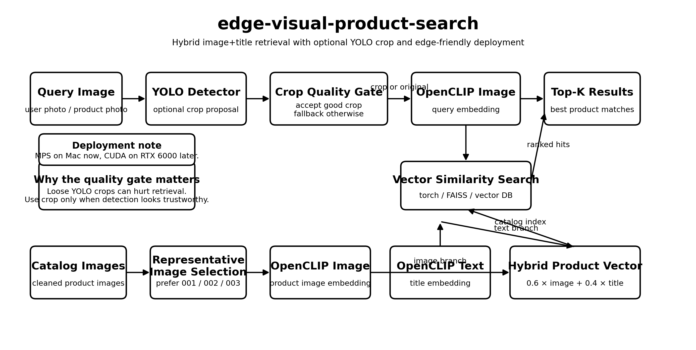
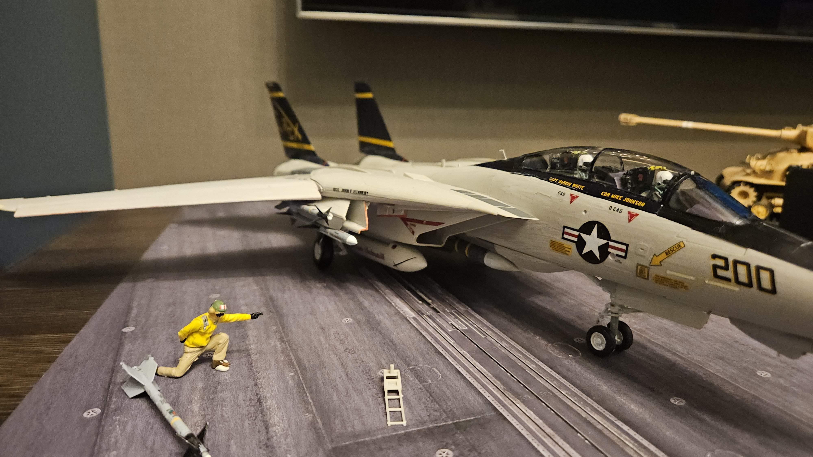
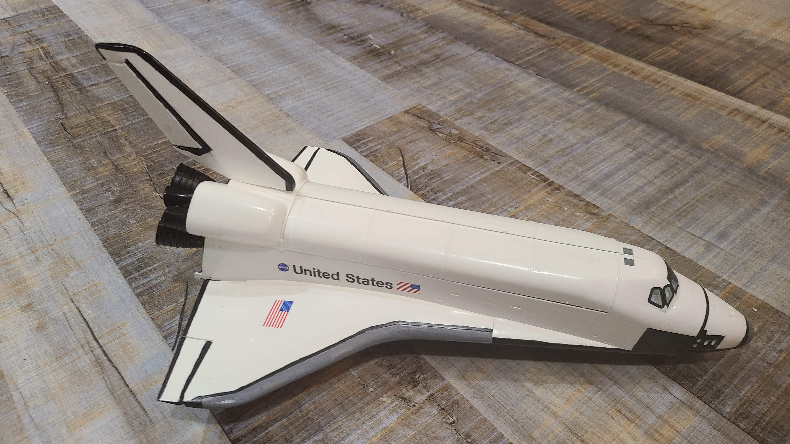

# edge-visual-product-search

A lightweight **visual product search pipeline** using:

- **YOLOv8** for optional object detection
- **OpenCLIP** for image + text embeddings
- **Hybrid product embeddings (image + title)**
- **Mac M1 / M2 / M3 GPU acceleration via MPS**
- Easy migration to **CUDA edge GPUs (RTX 4000 / RTX 6000)**

This repository demonstrates a practical architecture for **eCommerce visual search** and **edge inference workloads**.

---

# Architecture

Pipeline:
Query Image
│
▼
Optional YOLO Detection
│
▼
Crop Quality Gate
│
▼
CLIP Image Embedding
│
▼
Vector Similarity Search
│
▼
Top-K Product Matches

Catalog products are embedded using a **hybrid vector**:

product_vector = 0.6 × image_embedding + 0.4 × title_embedding

This improves semantic grouping (for example distinguishing **F-14 vs F-4 vs Space Shuttle**).

---

# Key Design Ideas

## Hybrid Product Embeddings

Each product embedding combines:

- **visual signal** from the product image
- **semantic signal** from the product title

This helps differentiate visually similar products.

Example:

F-14 Tomcat vs F-4 Phantom look similar visually, but title embeddings help separate them.

---

## Example Queries

| Query | Description |
|------|-------------|
|  | F-14 Tomcat aircraft |
|  | Space Shuttle Atlantis |

## YOLO Crop Quality Gate

YOLO detection is **optional** and guarded by a quality gate.

Loose bounding boxes can degrade retrieval performance.

The crop is rejected if:

- bounding box covers too much of the image
- bounding box touches image borders
- aspect ratio looks unreasonable
- detection confidence is low

If rejected, the system **falls back to the original image**.

---

## Edge-Friendly Architecture

This pipeline works well on **edge GPUs** because:

- YOLO inference is lightweight
- CLIP embedding models are small
- vector search is fast
- no large language model required

The same code supports:

Mac GPU:

--device mps

NVIDIA GPU:

--device cuda

---

# Installation

Requires **Python 3.9+**

Install dependencies:

pip install -r requirements.txt

Example requirements:

torch
torchvision
ultralytics
open_clip_torch
Pillow
numpy

---

# Build Product Embeddings

Generate hybrid embeddings for the product catalog.

python retrieval/mps_clip_retrieval_v21_hybrid.py build
--data-root ./data/tamiya_aircraft
--out-dir ./artifacts_v21_hybrid
--device mps
--max-images-per-product 1
--image-weight 0.6
--text-weight 0.4

---

# Search

### Without YOLO

python retrieval/mps_clip_retrieval_v21_hybrid.py search
--artifacts-dir ./artifacts_v21_hybrid
--query-image ./queries/f14.jpg
--device mps

### With YOLO crop

python retrieval/mps_clip_retrieval_v21_hybrid.py search
--artifacts-dir ./artifacts_v21_hybrid
--query-image ./queries/f14.jpg
--yolo-weights yolov8n.pt
--device mps

Default output returns **Top-2 product matches**.

---

# Example Results

Query: **F-14 Tomcat**

GRUMMAN F-14A TOMCAT (LATE MODEL)

GRUMMAN F-14A TOMCAT

Query: **Space Shuttle**

SPACE SHUTTLE ATLANTIS

MCDONNELL DOUGLAS F-4J PHANTOM II

---

# Dataset Example

Example catalog structure:

data/
tamiya_aircraft/
MODEL_NAME/
metadata.json
images/
001.jpg
002.jpg

Only **primary product images** are used for embeddings.

---

# Privacy Note

Query images included in this repository have had:

- EXIF metadata removed
- GPS location data stripped

---

# Future Improvements

Possible extensions:

- FAISS / Qdrant vector database
- reranking stage
- richer text prompts
- larger product catalogs
- deployment on edge GPU infrastructure

---

# License

MIT